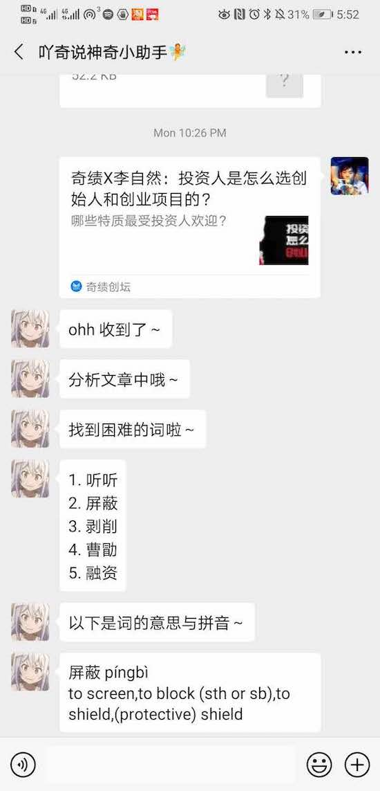
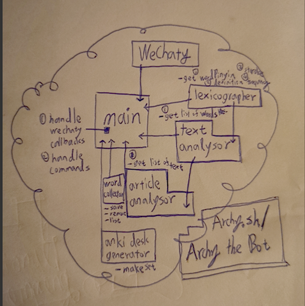

# Archy the Anki Bot 吖奇说Anki助理

A WeChat Assistant That Generates Anki Flashcards for Chinese Learners. 一个帮助外国人与海归学习中文的微信助理，可生成Anki卡片。

To learn more about this project you can check out this Wechaty blog post 了解更多可看博客文章: https://wechaty.github.io/2020/06/18/archyshuo-anki-assistant/

 

# Acknowledge

Huge thanks to

- [contributors of the jieba library for making jieba such an amazing tool!](https://github.com/fxsjy/jieba/graphs/contributors)

- [the CC-CEDICT community for doing such an great job and licensing it under CC BY-SA 3.0!](https://cc-cedict.org/wiki/)

- [contributors of the genanki library for writing such an easy-to-use tool!](https://github.com/kerrickstaley/genanki/graphs/contributors)

- the [WeChaty community](https://wechaty.github.io/) and [everyone involved in making WeChaty such a wonderful lib!](https://github.com/wechaty/wechaty#two_hearts-contributors) And [the Juzi.bot team](https://botorange.com/) for [opening up their padplus protocol ecosystem](https://github.com/juzibot/Welcome/wiki/Support-Developers) for outsiders like me!

# Current Use Cases 用例

1: Extract difficult Chinese words from WeChat articles.

一、从微信公众号文章中提取难词。

2: Annotate Chinese words with pinyin and rough definitions (expressed in English).

二、给词语标上拼音与英文大意。

3: Generate a deck of Anki notes from Chinese words.

三、从一组词语生成一组Anki卡片。

# Screenshots

# Getting started

0. Obtain a [wechaty-puppet-padplus](https://github.com/wechaty/wechaty-puppet-padplus) token or use the web protocol if that works for you. [Learn more about different puppet protocols in WeChaty here](https://github.com/wechaty/wechaty#3-switch-protocolpuppet).

   - Here is how to obtain the free token from the official Juzi.bot page

     - ### 如何获取免费 token 
     1. 添加 botorange_yeah 为微信好友，成功填写开源激励计划申请表和项目信息的开发者，即可领取 15 天免费 Token 用于 MVP 版本开发。
     2. 15天内，提交到 wechaty 的任何一个项目下的 pull request 被 merge 即可成为 wechaty 的 contributor，可以领取长期有效的 Token。最简单的方式是在 wechaty 的博客项目下发表一篇博客，博客项目地址： https://github.com/wechaty/wechaty.github.io

       更多 Token 信息详细见 https://github.com/juzibot/Welcome/wiki/Everything-about-Wechaty

1. Install python dependencies.
  - jieba
  - pinyin
  - genanki

2. `yarn install`

3. `nodemon src/main.ts --ignore "userDataFiles/*"`

# TO-DOs

- refactor according to informal-uml.png

- Refinements 功能改良

  - As we can see the ad hoc word difficulty scoring formula isn't performing super great at the moment. That is something I need to experiment and perhaps do some text scraping and use a combination of [BERT](https://github.com/google-research/bert) with a self-trained model, etc to achieve a more accurate scoring system.  

  - The pretrained `paddle` model in `jieba` works well in general but it may still give unsatisfying results (e.g. at times when a sentence contains a person's name). Trying out different models aside, my plan is to engineer around the problem (i.e. to have results that always make sense to the users) using tools like [StandfordNLP's stanza](https://github.com/stanfordnlp/stanza) or approach the problem differently, etc.

  - I'm also thinking about extending the `Lexicographer` to contain definitions from different dictionaries as well as online search results that is useful to the language learners, etc.

## Some thoughts about the future 未来打算

  - Anki is an amazing and very powerful tool but I feel like it is too exam-orientated in the sense that it is best utilised by people (e.g. medical students) with the aim of doing well in an upcoming exam, etc. And from a UI/UX perspective it has a steep learning curve. I'm currently working on a WeChat and TikTok MiniApp inspired by Anki but with a more laid-back take on it. The end product will a nichely designed tool for people who want to improve their Chinese with the intention to read and speak better rather than scoring well in exams. In the premium version it would come with a chatbot assistant like [Archy the Anki bot](https://github.com/archywillhe/archy-the-anki-bot).

  - [Archy the Anki bot](https://github.com/archywillhe/archy-the-anki-bot) will always remain free and open-source on Github. I will continue to improve it as I work on the commercial aspect of the project described above so that I can continue doing this full-time and maybe it can become ramen profitable. 🍜 🍜 🍜

  - If things go well I would like to scale it up to cover different language learning (e.g. English, Japanese, German), as well as going beyond language learning to become a full-fledge note-taking productivity tool for autodidacts. It will be like [Notion](https://www.notion.so/) but more for remembering stuff and visualising knowledge representation. And at the core of it would be a cross-platform chatbot assistant\* =) At the moment I'm reading up on how to train a model to do handwritten diagram recognition (e.g. mind map, UML, flow chart, etc) as well as looking into visual languages like [Chalktalk](https://arxiv.org/pdf/1809.07166.pdf). ⚗️ ⚗️ ⚗️

> \*: in general from a product perspective I believe chatbot is a great I/O into the world, especially as social media apps become the new browsers.
>

---

If you are interested in the development of this project feel free to follow Archy.sh on WeChat and TikTok or [join our mailing list](https://mailing-list.xn--nqr.xn--fiqs8s/) =)

Also please feel free to fork my repo, deploy your own bot, or just do anything with the code, or open issues if there are any! Thanks!

## Copyright & License

* Code © 2020 Archy Will He \<a@castella.art\>
* Code released under the Apache-2.0 License
* Docs (coming up) to be released under Creative Commons
